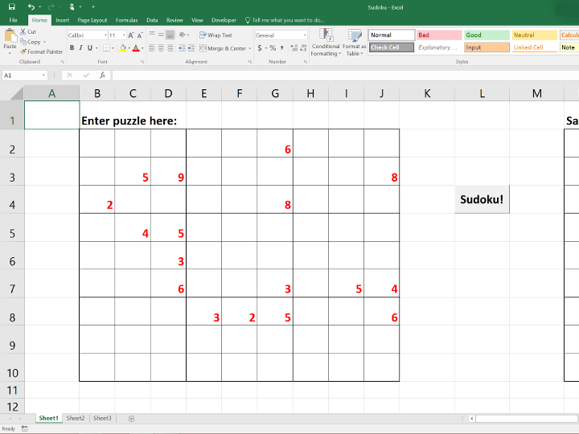
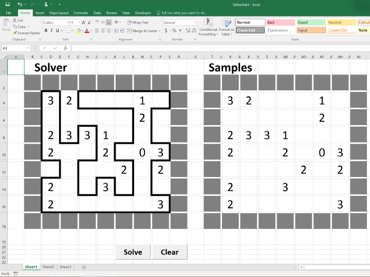
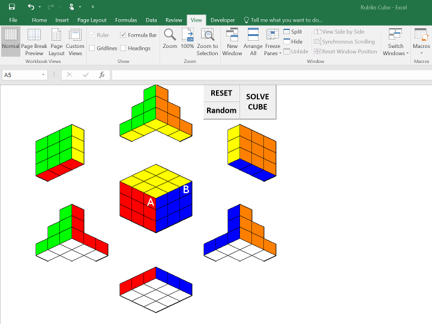

## Excel Puzzle Solvers
While most people think VBA is only useful for creating Excel Macros, much can be achieved with VBA script. It is the language I started my programming journey.

Here is a collection of my past projects in VBA. I always love logic puzzles and think it would probably be fun to write programs that can solve these puzzles once and for all.

[*Sudoku*](https://en.wikipedia.org/wiki/Sudoku) is a game that needs no explanation. You have probably played it before.

[*Slithelink*](https://en.wikipedia.org/wiki/Slitherlink) is another game by Japanese game publisher *Nikoli* (the same guy that brought you *Sudoku*). Basically your job is to form a loop around the numbers so that each square has the same number of line segments around it as the number indicated at the center.

The strategy for solving *Sudoku* and *Slithelink* is to use constraint propagation quickly narrow down our search space for a viable solution. After a couple iteration, if we hit a dead end without arriving at a solution, tree search will be activated. A random move will be made and we will continue with constraint propagation.

As for [*Rubik's Cube*](https://en.wikipedia.org/wiki/Rubik%27s_Cube), I wanted to challenge myself to write something in VBA that simulate rendering of an image like those old school 8 bits games. All six sides of the cube can be rotated by clicking on the squares on the cube object in specific order (try clicking **A** followed by **B**). I also implemented algorithms to solve the cube using the official [seven steps method](http://www.hasbro.com/common/documents/dad2884a1c4311ddbd0b0800200c9a66/F28679A65056900B1029C7B903D50B13.pdf).

Have fun playing

